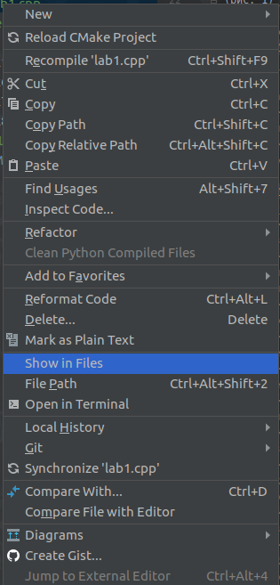

МИНИСТЕРСТВО НАУКИ  И ВЫСШЕГО ОБРАЗОВАНИЯ РОССИЙСКОЙ ФЕДЕРАЦИИ  
Федеральное государственное автономное образовательное учреждение высшего образования  
"КРЫМСКИЙ ФЕДЕРАЛЬНЫЙ УНИВЕРСИТЕТ им. В. И. ВЕРНАДСКОГО"  
ФИЗИКО-ТЕХНИЧЕСКИЙ ИНСТИТУТ  
Кафедра компьютерной инженерии и моделирования
  
### Отчёт по лабораторной работе № 1  по дисциплине "Программирование"
 
​
студента 1 курса группы 191(2)  
Лисовского Владимира Сергеевича  
направления подготовки 09.03.0Х "191-2-б-о" 

#### Цель
изучить основные возможности создания и отладки программ в IDE Clion.
 
  
1. **Как создать консольное приложение С++;**
  
    * Нужно открыть `File` меню и выбрать `New Project` (рис. 1). 
   
_(рис. 1)_

    * Выбрав `С++ Executable` указать стандарт языка и путь к новому файлу (рис. 2).
   
_(рис. 2)_

    * Нажать `Create`.
  
2. **Как изменить цветовую схему (оформление) среды;**
  
Нужно использовать комбинаци `Ctrl + Alt + S`. В выпадающем списке `Appearance & Behavior` выбрать вкладку `Apperance`.
В списке `Theme` выбрать подходящую цветовую тему (рис. 3).
   
_(рис. 3)_
  
3. **Как закомментировать/раскомментировать блок кода средствами СLion;**
  
Для комментирования/раскомментирования однострочными комментариями нужно воспользоваться комбинацией `Ctrl + /`.
Для комментирования/раскомментирования многострочными комментариями нужно воспользоваться комбинацией `Ctrl + Shift + /`.
  
4. **Как открыть в проводнике папку с проектом средствами Clion;**
  
Открыть меню проекта слева. В контекстном меню интерисующего вас файла выбрать `Show in Files` (рис. 4).

    
_(рис. 4)_
  
5. **Какое расширение файла-проекта используется в CLion;**
  
В CLion для открытия проекта используется файл `CMakeLists.txt`, который находится в папке каждого проекта.
  
6. **Как запустить код без отладки (не менее 2 способов);**
  
    * В `Run` меню выбрать `Run`;
    * Использовать комбинацию `Shift + F10`;
  
7. **Как запустить код в режиме отладки (не менее 2 способов);**
  
    * В `Run` меню выбрать `Debug`;
    * Использовать комбинацию `Shift + F9`;
  
8. **Как установить/убрать точку останова (breakpoint);**
  
Нажать справа от номера соответсвующей строки. В результате установится/уберется красная точка останова (рис.5).

    
    _(рис. 5)_
  
9. 
    * **Какое значение содержит переменная i в 5й строке?**
        
        Переменная i содержит значение 0.
    * **Какое значение содержит переменная i в 6й строке?**
        
        Переменная i содержит значение 0.
10. 
    * **Какое значение содержит переменная i в 5й строке?**
        
        Переменная i содержит значение 0.
    * **Какое значение содержит переменная i в 6й строке?**
        
        Переменная i содержит значение 0.
  

#### Ввывод
в ходе лабораторной работы были изучены основыне возможности создания и отладки программ в IDE Clion, как
* Создание консольных приложений;
* Возможность смены цветового оформления среды;
* Возможноть комментирования/раскомментирования кода;
* Возможность открыть требуемый файл в проводнике;
* Возможность открыть созданный ранее проект;
* Возможность запуска кода как с отладкой, так и без нее разными способами;
* Возможность устанавливать точки останова;
* Возможность узнавать значения переменных в ходе выполнения программой команд с точкой оствнова.

  
<table>
<tr><td>Научный руководитель  старший преподаватель кафедры  компьютерной инженерии и моделирования</td>
<td>(оценка)</td>
<td>Чабанов В.В.</td>
</tr>
</table>
  
​
Симферополь, 2019
